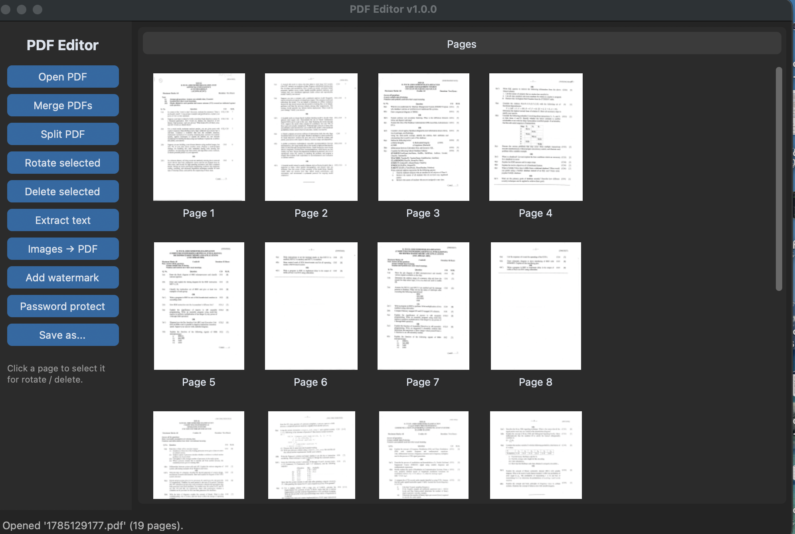
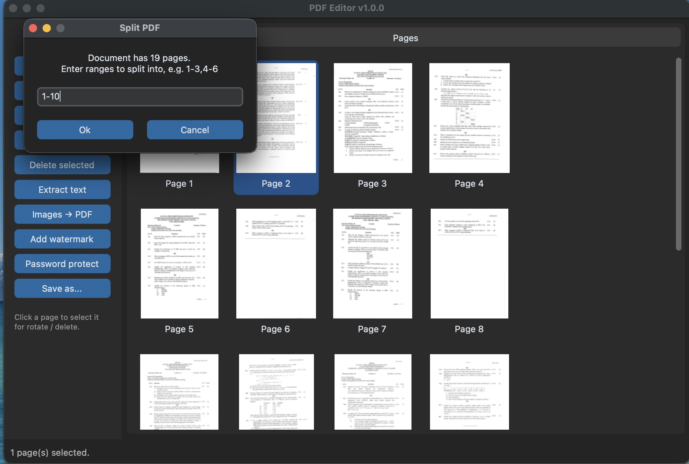
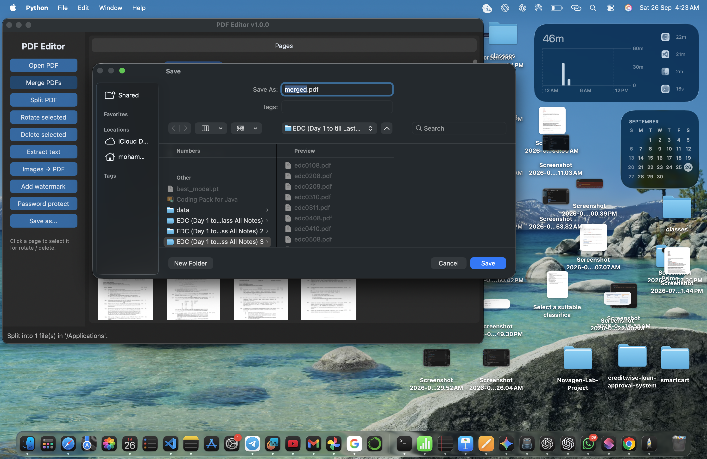
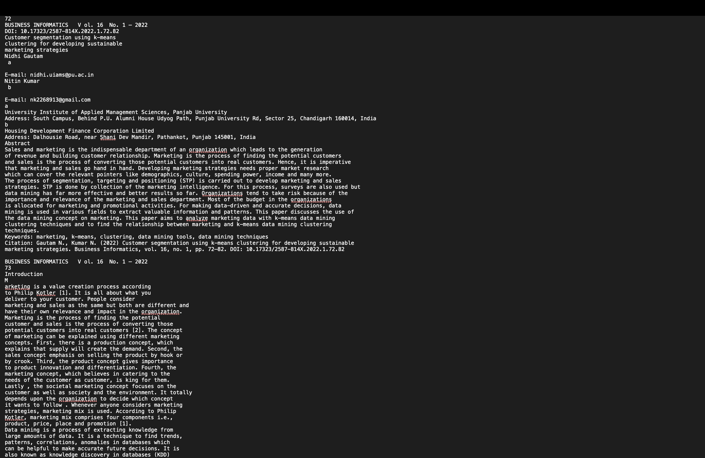

# PDF Editor

A desktop PDF toolkit with a modern graphical interface, built with **CustomTkinter** and **pypdf**. Supports the most common PDF operations, with page previews, logging, and exception handling for corrupted files.

## Features

- **Open & preview** any PDF, with thumbnail previews of every page
- **Merge** two or more PDFs into one
- **Split** a PDF into multiple files by page range (e.g. `1-3,4-6`)
- **Rotate** selected pages by 90 degrees
- **Delete** selected pages
- **Extract text** from the whole document to a `.txt` file
- **Images to PDF**: combine PNG/JPG images into a single PDF
- **Watermark**: stamp diagonal text across every page
- **Password protect**: encrypt a PDF with a user password
- **Save as**: export the current state of the document
- Graceful handling of corrupted, missing, or password-protected PDFs
- Logging to `logs/pdf_editor.log`

## Requirements

- Python 3.11+
- See `requirements.txt`

## Installation

```bash
git clone https://github.com/uruj04/pdf-editor.git
cd pdf-editor
pip install -r requirements.txt
```

## Usage

```bash
python main.py
```

1. Click **Open PDF** to load a file. Thumbnails of every page appear.
2. Click a page thumbnail to select it (click again to deselect).
3. Use the sidebar buttons for merge, split, rotate, delete, extract text, images-to-PDF, watermark, or password protection.
4. **Rotate** and **Delete** apply to whichever pages are currently selected.
5. Use **Save as...** at any point to export the current document.

## Building a standalone executable

This project uses PyInstaller to produce a standalone app that runs without Python installed.

```bash
pip install pyinstaller
pyinstaller pdf_editor.spec
```

The executable is created in `dist/PDFEditor` (`dist/PDFEditor.exe` on Windows, `dist/PDFEditor.app` on macOS).

## Project Structure

```
pdf-editor/
├── main.py                    # Entry point
├── pdfeditor/
│   ├── gui.py                 # CustomTkinter interface
│   ├── pdf_engine.py          # All PDF operations (no UI code)
│   ├── logger_config.py       # Logging setup
│   └── exceptions.py          # Custom exceptions
├── tests/
│   └── test_pdf_engine.py     # Unit tests (18 tests)
├── screenshots/                # App screenshots for this README
├── pdf_editor.spec             # PyInstaller build spec
├── requirements.txt
└── README.md
```

## Architecture

The code is split so the PDF logic has no dependency on the GUI:

**GUI** (`gui.py`) → **Engine** (`pdf_engine.py`)

- `pdf_engine.py` contains a single `PdfDocument` class with all PDF operations (merge, split, rotate, delete, reorder, extract text, watermark, protect). It raises custom, descriptive exceptions and can be tested completely independently of any interface.
- `gui.py` only handles user interaction: file dialogs, page selection, and rendering thumbnails. It calls into the engine and translates errors into user-friendly dialogs.
- This separation is why the engine has 18 passing unit tests, even though the GUI itself cannot be unit tested the same way.

## Error Handling

- Corrupted or unreadable PDFs raise `CorruptedPdfError` with a clear message instead of crashing.
- Password-protected PDFs raise `EncryptedPdfError` if no or the wrong password is given.
- Invalid page numbers or ranges raise `InvalidPageRangeError`.
- Any unexpected error is caught at the GUI layer, logged to `logs/pdf_editor.log`, and shown to the user without closing the app.

## Running Tests

```bash
python -m unittest discover -v
```

## Screenshots

## Screenshots

**Main window with page thumbnails**


**Split dialog**


**Merge PDFs**


**Extracted text**

## Author

**<Your Name>** — Python Internship, Algoryx
[LinkedIn](https://linkedin.com/in/mohd-uruj-a1207038a) · [GitHub](https://github.com/uruj04)
